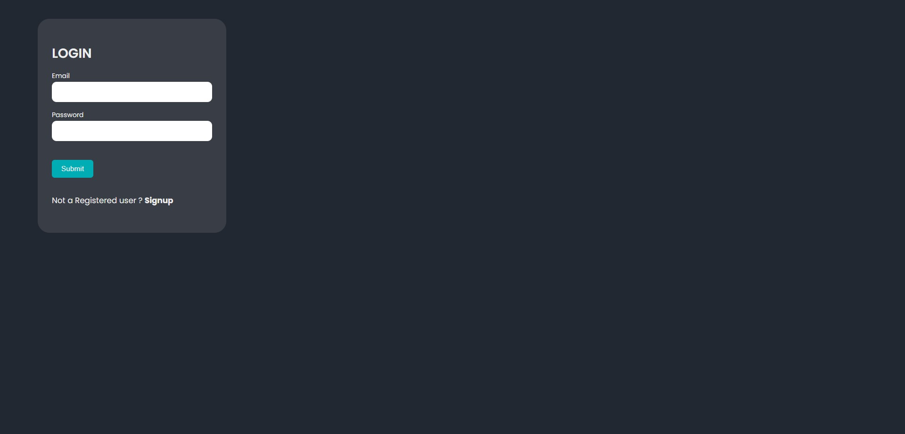
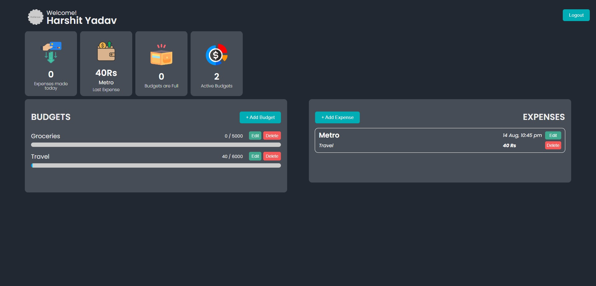
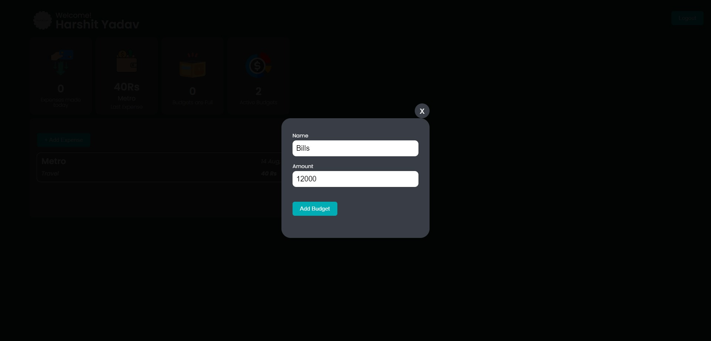

# Expenses Tracker Frontend

Welcome to the Expenses Tracker Frontend repository! This repository contains the frontend code for an Expenses Tracker application that helps you keep track of your expenses, manage your budget, and gain insights into your spending habits. Whether you're an individual looking to manage personal expenses or a small business owner keeping track of company finances, this application has you covered.






## Features

- **User Authentication:** Securely sign up and log in to your account to keep your financial data private. User authentication is implemented using Passport.js sessions for enhanced security.
- **Expense Logging:** Easily add, edit, and delete expenses, with details such as amount, category, date, and description. RTK Query is utilized to cache data and minimize server requests when interacting with the expense data.
- **Budget Management:** Set monthly budgets for different expense categories and receive notifications when you approach or exceed your limits.
- **Data Visualization:** Visualize your spending patterns with Cards. This helps you identify trends and make informed financial decisions.
- **Expense Categories:** Categorize your expenses into custom categories for better organization and analysis.
- **Form Handling:** Formik is used for handling forms throughout the application, providing a seamless and user-friendly experience.

## Technologies Used

- **React:** The frontend is built using React, a popular JavaScript library for building user interfaces.
- **Redux and RTK Query:** Redux is used for state management, and RTK Query extends it to efficiently handle data fetching, caching, and updates.
- **Authentication:** User authentication is implemented using Passport.js sessions to secure user data and access.
- **Form Handling:** Formik is used for handling forms, simplifying form validation and submission.

## Getting Started

Follow these steps to set up the Expenses Tracker Frontend locally:

1. **Clone the repository:**
   ```
   git clone https://github.com/yadavhrsit/ExpanseTracker-Frontend.git
   cd expenses-tracker-frontend
   ```

2. **Install dependencies:**
   ```
   npm install
   ```

3. **Configure API endpoint:**
   In the `src/apiSlice.js` file, update the `BASE_URL` with the URL of your Expenses Tracker Backend API.

4. **Run the application:**
   ```
   npm start
   ```

5. **Access the application:**
   Open your web browser and go to `http://localhost:3000` to use the Expenses Tracker application.


We hope you find the Expenses Tracker application helpful in managing your finances effectively. If you have any questions, issues, or suggestions, please don't hesitate to open an issue or contact us.

Happy budgeting!
